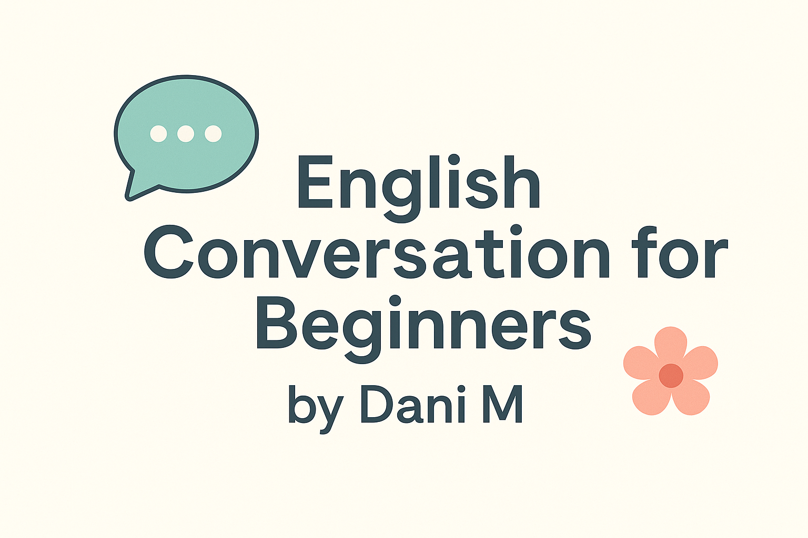

# 🗣️ English Conversation for Beginners by Dani M

> _Learn to speak English confidently, step by step._  
> _Aprende a hablar inglés con confianza, paso a paso._

---



---

## 🌸 Welcome / Bienvenida

Hello and welcome! 👋  
I’m **Dani M**, and this is your **friendly learning space** to start speaking English in a fun, simple, and personalized way.  
Here you’ll find lessons, exercises, and useful materials to help you feel confident when communicating in English — whether it’s your first word or your first full sentence!  

¡Hola y bienvenido/a! 👋  
Soy **Dani M**, y este es tu **espacio de aprendizaje amigable** para comenzar a hablar inglés de forma divertida, sencilla y personalizada.  
Aquí encontrarás lecciones, ejercicios y materiales útiles que te ayudarán a sentirte seguro/a al comunicarte en inglés — ¡ya sea tu primera palabra o tu primera conversación completa!

---

## 🎯 About the classes / Sobre las clases

🌱 **Level / Nivel:** A1 – A2 (Beginners / Principiantes)  
👥 **Format / Formato:** Personalized classes  
💬 **Focus / Enfoque:** Conversation + real-life situations  
🎧 **Goal / Objetivo:** Build confidence and natural communication skills  

Each class is adapted to your rhythm and interests — we’ll talk, practice, and learn naturally.  
Cada clase se adapta a tu ritmo e intereses — conversaremos, practicaremos y aprenderemos de forma natural.

---

## 📘 How to use this repository / Cómo usar este repositorio

| Step | Action | Acción |
|------|---------|--------|
| 1 | Go to the **Lessons** folder | Ve a la carpeta **Lessons** |
| 2 | Read one lesson per week | Lee una lección por semana |
| 3 | Use the **Exercises** for practice | Usa los **Exercises** para practicar |
| 4 | Check the **Resources** for extra help | Revisa **Resources** para ayuda adicional |
| 5 | Track your progress using the **Student Progress Template** | Lleva tu progreso con el **Student Progress Template** |


## ✨ Extra Materials / Materiales adicionales

| Category | Description / Descripción |
|-----------|--------------------------|
| 🎧 **Audio Practice** | Listen to short dialogues recorded by Dani |
| 🧠 **Mini Quizzes** | Simple practice questions with checkboxes |
| 🪪 **Creative Commons License** | Free use with credit — CC BY-NC 4.0 |
| 🖼️ **Cover Image** | Personalized banner (your future touch!) |
| 📓 **Progress Template** | Track weekly learning goals |
| 🎯 **Weekly Missions** | Fun challenges to use English daily |

---

## 🧩 Example Lesson / Ejemplo de lección

```
## 🗣️ Lesson 01 — Greetings / Saludos
**Level:** A1  
**Objective:** Learn how to greet and introduce yourself.  
**Objetivo:** Aprender a saludar y presentarte.

### Dialogue / Diálogo
- A: Hi! How are you?  
- B: I’m fine, thank you! And you?

### Vocabulary / Vocabulario
| English | Español |
|----------|----------|
| Hello | Hola |
| Nice to meet you | Encantado/a |

### Practice / Práctica
🎧 Listen and repeat each phrase  
🗣️ Try the dialogue with a partner or record yourself
---

🌷 *End of Example Lesson / Fin del Ejemplo de Lección* 🌷

---

🧠 License / Licencia

📜 License: CC BY-NC 4.0

You are free to use and share this material with credit and non-commercially.
Eres libre de usar y compartir este material dando crédito y sin fines comerciales.

💌 Connect with Dani M

If you’re learning English with me, you’re already doing something amazing. 🌼
Each small step counts — and I’m here to guide you through it.

📧 You can contact me for classes or questions:
Email: danimonte03@gmail.com
GitHub: github.com/Dmontero94

“Every time you speak, you grow.” 🌱